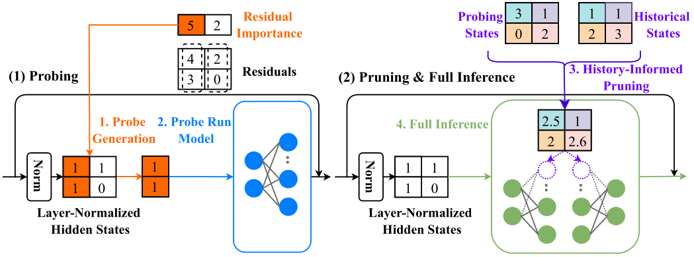

# Probe Pruning: Accelerating LLMs through Dynamic Pruning via Model-Probing

[ICLR 2025] This is an implementation of fine-tuning baselines in *Probe Pruning: Accelerating LLMs through Dynamic Pruning via Model-Probing*



**Probe Pruning (PP)** is executed in four stages: (1) **PP** selects key samples and tokens from the layer-normalized hidden states, based on residual importance, to create a \textit{small yet crucial} probe. (2) **PP** deploys this probe to run a few model layers ahead and obtains the probe's intermediate hidden states. (3) **PP** integrates the probing states with historical states and uses the integrated states to calculate the pruning metric and prune weight channels. (4) **PP** performs full inference on the remaining weights.

## Requirements

- Tested under Python 3.10.
- See requirements.txt in each baseline. Tested using a separate environment. Be careful about reference conflicts if you are using only one environment.  
- C4 calibration dataset can be found [here](https://drive.google.com/file/d/1dTl7rPeOqKqQmFPxldITolJTVAp8MScv/view?usp=sharing). Please download it and place it under the root folder in each baseline.
- Checkpoints can be found [here](https://drive.google.com/drive/folders/170q3BcGBaG8mGu7KTc6eVxrN36S-dNNJ?usp=drive_link)

## Instruction

- Prepare model weights and modify the scripts to reflect the updated path.
- Uncomment to run other tasks (vary of seed, other pruning ratio, etc.).
- Select GPU index and change the last parameter based on your machine.
- Code for PP with evaluation script is available [here](). 

## Examples

- (LLM-Pruner) Pruning and recovery re-training on LLaMA-2-7B.

  ```ruby
  cd LLM-Pruner
  bash script/prune_0.sh
  ```

- (LoRAPrune) Pruning during training on LLaMA-2-7B.

  ```ruby
  cd LoRAPrune
  bash script/prune.sh
  ```


## Results

*Zero-shot Performance of LLaMA-2-7B/13B and OPT-13B After Pruning Attention and MLP Blocks Without Fine-Tuning, PP demonstrates superior performance in nearly all scenarios.*

| Method                  | Pruning Ratio | LLaMA-2-7B (Text Generation) ↓ | LLaMA-2-13B (Text Generation) ↓ | OPT-13B (Text Generation) ↓ | LLaMA-2-7B (Commonsense Reasoning) ↑ | LLaMA-2-13B (Commonsense Reasoning) ↑ | OPT-13B (Commonsense Reasoning) ↑ |
| ----------------------- | ------------- | ------------------------------ | ------------------------------- | --------------------------- | ------------------------------------ | ------------------------------------- | --------------------------------- |
| **Dense**               | 0%            | 6.0 (0.1)                      | 5.1 (0.1)                       | 11.6 (0.1)                  | 64.0                                 | 66.2                                  | 57.2                              |
| **Full-Batch Probing**  | 20%           | 7.3 (0.1)                      | 6.2 (0.1)                       | 12.6 (0.1)                  | 62.6                                 | 65.3                                  | 56.4                              |
| **Wanda-sp**            | 20%           | 10.6 (0.1)                     | 9.0 (0.1)                       | 17.4 (0.1)                  | 61.5                                 | 65.0                                  | 55.2                              |
| **FLAP**                | 20%           | 10.3 (0.1)                     | 7.5 (0.1)                       | 18.8 (0.2)                  | 61.4                                 | 64.6                                  | 54.9                              |
| **LoRAPrune w/o LoRA**  | 20%           | 22.7 (0.9)                     | 16.1 (0.7)                      | N/A                         | 57.9                                 | 58.9                                  | N/A                               |
| **LLM-Pruner w/o LoRA** | 20%           | 17.5 (1.6)                     | 11.3 (0.7)                      | N/A                         | 57.4                                 | 61.3                                  | N/A                               |
| **PP**                  | 20%           | **8.1 (0.1)**                  | **6.7 (0.1)**                   | **14.7 (0.1)**              | **62.8**                             | **65.3**                              | **56.5**                          |
| **Full-Batch Probing**  | 40%           | 13.6 (0.1)                     | 8.9 (0.1)                       | 17.9 (0.2)                  | 58.7                                 | 62.9                                  | 54.0                              |
| **Wanda-sp**            | 40%           | 43.8 (1.5)                     | 21.6 (0.4)                      | 42.7 (0.7)                  | 54.8                                 | 56.6                                  | 50.5                              |
| **FLAP**                | 40%           | 38.9 (1.3)                     | 15.5 (0.0)                      | 51.0 (0.7)                  | 54.9                                 | 60.6                                  | 50.8                              |
| **LoRAPrune w/o LoRA**  | 40%           | 129.5 (3.0)                    | 74.8 (6.4)                      | N/A                         | 45.4                                 | 48.1                                  | N/A                               |
| **LLM-Pruner w/o LoRA** | 40%           | 51.1 (4.3)                     | 34.5 (2.4)                      | N/A                         | 47.8                                 | 52.0                                  | N/A                               |
| **PP**                  | 40%           | **16.8 (0.1)**                 | **11.3 (0.1)**                  | **26.7 (0.3)**              | **56.6**                             | **61.0**                              | **53.1**                          |

